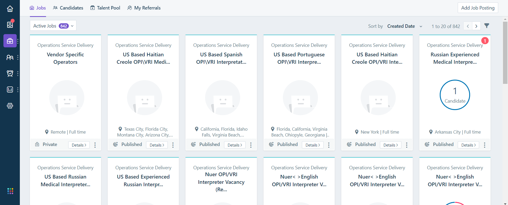
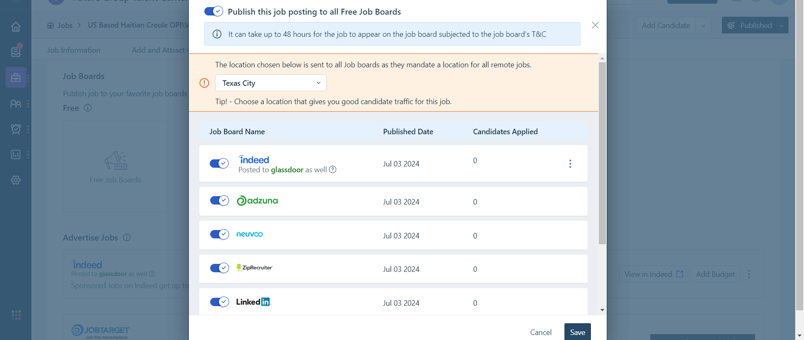

# Automated Job Posting Refresher

## Project Overview

This project automates the refreshing of job postings on a corporate job portal. Traditionally, refreshing these postings manually is not only tedious but also highly time-consuming. This automation significantly reduces the manual effort required and speeds up the process.

## Key Features

- **Automated Refresh**: Automates the refreshing of up to 800 job postings.
- **Time Efficient**: Reduces the manual time required for refreshing each job posting.

## Time Savings

With each job refresh taking approximately 40 seconds manually, automating this process saves a significant amount of time:

- **Manual Time for One Refresh**: 40 seconds
- **Total Time for 800 Refreshes**: (800 * 40) seconds = 32,000 seconds = approximately 8 hours and 53 minutes.

By automating this process, nearly 9 hours of manual labor is saved each time the job postings need to be refreshed, which is generally each two weeks.

## How It Works

1. **Load the Job Posting Page**: The script navigates to the job posting section.

*Job Postings*
3. **Opens the Job board postings**: The script opens the job boards that this posting is advertised on   
4. **Unlists the posting on all job boards**: Mitigating occasional 404 webpage errors.
5. **Re-lists the posting on all job boards**:
   
*Job Board Interface where refreshing happens*
7. **Repeat steps 1-4**.
8. **Log Results**: Outputs the completion of each job posting refresh.

## Setup and Installation

For the client to be able to use this program, a couple of options were suggested. However, the most user-friendly, hassle-free for the user was to convert the script into an executable .exe file that they can run on their local computer with no need for dependencies. 

